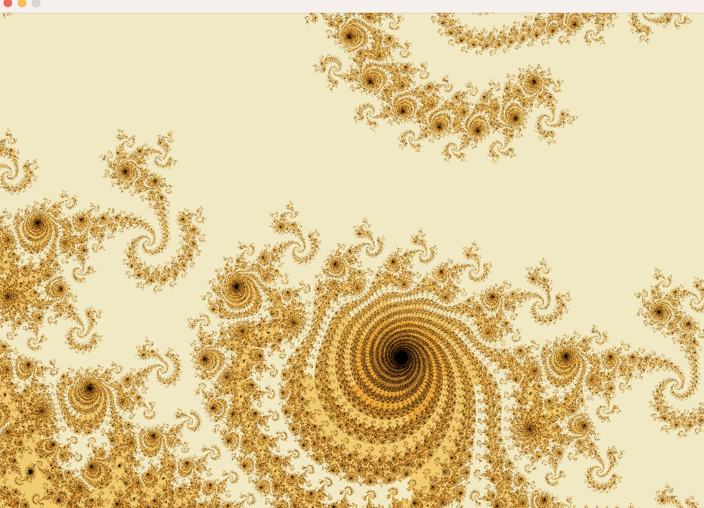
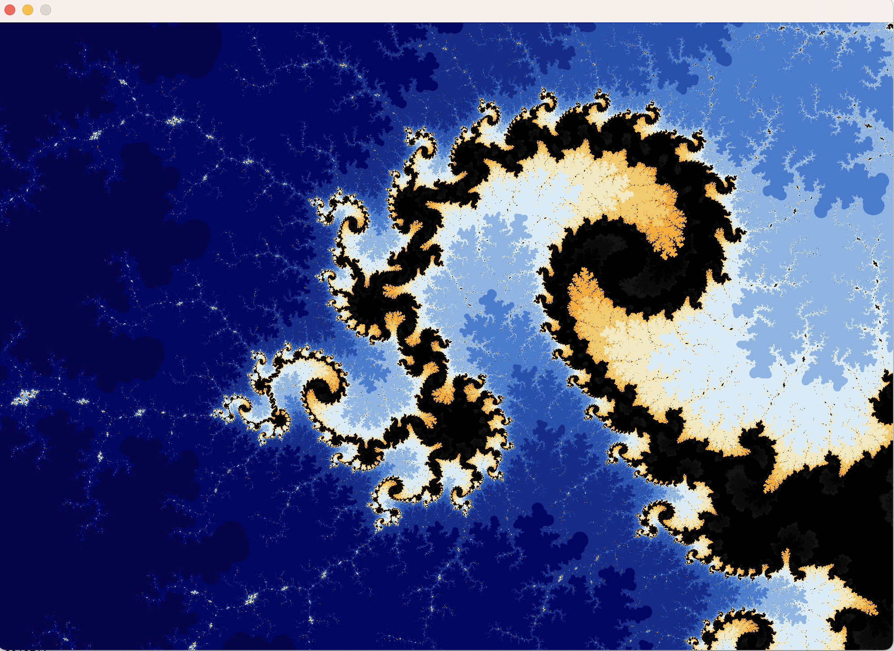

A recursive Mandelbrot fractal generator for Macbooks in C using SDL for graphics. 

Currently:
* Basic "zoom in" available by selecting a area using the touchpad ( but no "zoom out" available)
* Only grayscale images for now. Colours coming soon.
* Uses naive escape time calculations (will eat CPU)
* Depends on platform resolution of float/double. "Infinite precision" to come later.

Some sample fractal images rendered by this generator:

