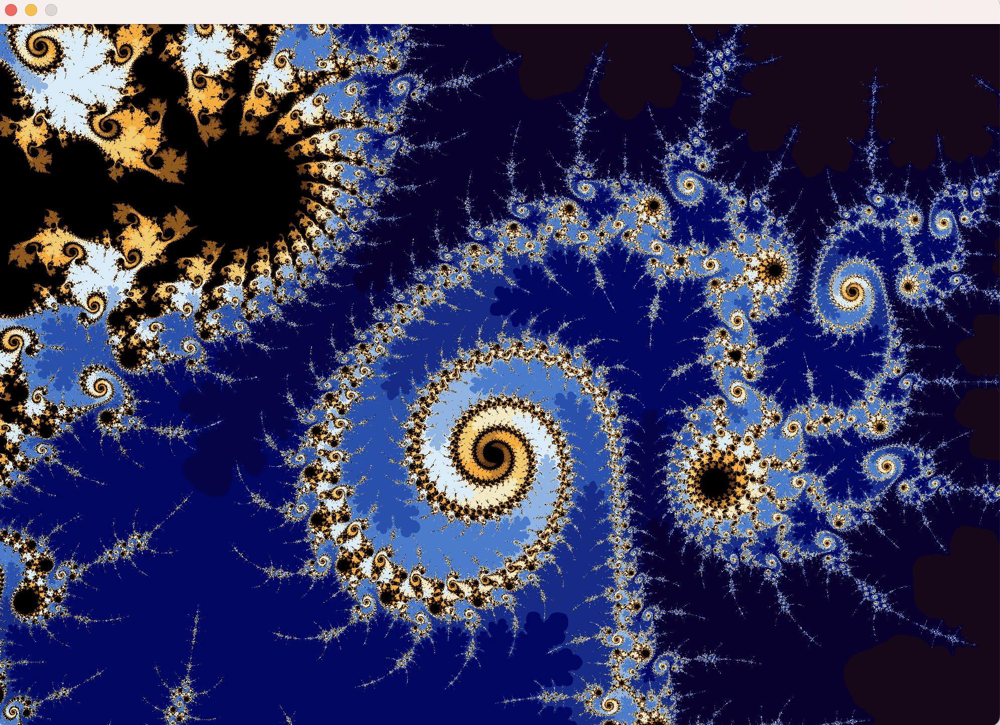

A recursive Mandelbrot fractal generator for Apple Macbooks. 

Currently:
* Basic "zoom in" available by selecting a area using the touchpad. Zoom out via CMD-z (osx undo)
* "Zoom In" preserves aspect ratio.
* A simple color palette as well as RGB grayscale palette available
* Uses naive escape time calculations with iteration normalization for color smoothing
* Depends on platform resolution of float/double. "Infinite precision" to come later.
* Only tested on a M1 Macbook laptop screen.

INSTALL:
* You need a c99 C complier. You can get clang from Xcode Command Line Tools.
* You need make (or you can copy the build line from the makefile)
* You will need SDL2, "brew install sdl2" will do the job
* git clone this repo; cd into_repo; make; ./a.out

Some sample fractal images rendered by this generator:

